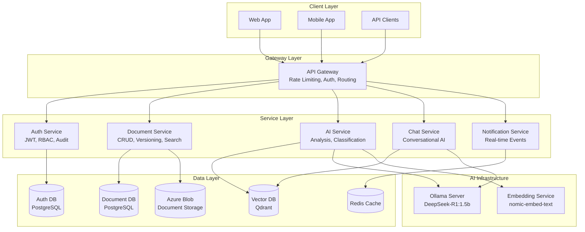

<div align="center">

# 🚀 DocAI - Enterprise Document Intelligence Platform

[](https://github.com/DocAI-DocumentAI/DocAI_KingOfBE/actions)
[](https://sonarcloud.io/dashboard?id=DocAI)
[](https://codecov.io/gh/DocAI-DocumentAI/DocAI_KingOfBE)
[](https://opensource.org/licenses/MIT)
[](https://dotnet.microsoft.com/)

_Transform your document chaos into intelligent, searchable knowledge_

[📋 Features](#-features) • [🏗️ Architecture](#️-architecture) • [🚀 Installation](#-installation) • [📘 Usage](#-usage) • [👨‍💻 Contributing](#-contributing)

</div>

---

## 📋 Features

### The Problem

Enterprise documents are scattered across systems, unsearchable, and locked in silos. Teams waste **2.5 hours daily** searching for information that should be instantly accessible.

### Our Solution

DocAI transforms document management with an AI-first approach:

| Traditional Systems   | DocAI                        |
| --------------------- | ---------------------------- |
| Manual categorization | AI-powered classification    |
| Keyword search        | Semantic understanding       |
| Static documents      | Interactive chat interface   |
| Siloed access         | Department-aware permissions |

### Key Capabilities

- **🔍 Intelligent Search**: Find documents using natural language queries
- **🤖 AI Analysis**: Automatic document classification and information extraction
- **🔐 Enterprise Security**: Role-based access control with department isolation
- **💬 Document Chat**: Ask questions about your documents and get instant answers
- **📱 Multi-platform**: Web, mobile, and API access to your document intelligence

---

## 🏗️ Architecture

### System Overview



### Tech Stack

- **Backend**: .NET 9, C#, ASP.NET Core
- **Databases**: PostgreSQL, Qdrant (Vector DB), Redis (Cache)
- **AI Models**: DeepSeek-R1:1.5b, nomic-embed-text
- **Infrastructure**: Docker, Kubernetes, Azure Blob Storage
- **Authentication**: JWT, Custom RBAC/ABAC system
- **API Gateway**: Custom built on ASP.NET Core

---

## 🚀 Installation

### Prerequisites

```bash
# Development Environment
.NET 9 SDK, Docker Desktop, Git
PostgreSQL 15+, Redis 7+

# Production Environment
Kubernetes 1.28+, Helm 3.0+
```

### Local Development Setup

```bash
# Clone repository
git clone https://github.com/DocAI-DocumentAI/DocAI_KingOfBE.git
cd DocAI_KingOfBE

# Setup environment
cp .env.example .env
# Edit .env with your configuration

# Start dependencies
docker-compose up -d postgres redis ollama

# Run services
dotnet run --project ApiGateway
```

### Production Deployment

```bash
# Deploy with Helm
helm repo add docai https://charts.docai.com
helm install docai docai/docai-platform \
  --set global.domain=your-domain.com \
  --set auth.jwt.secret=your-secret

# Verify deployment
kubectl get pods -n docai
curl https://your-domain.com/health
```

---

## 📘 Usage

### Authentication

```bash
# Register a new user
POST /api/auth/register
{
  "email": "user@example.com",
  "password": "SecurePass123!",
  "role": "Member",
  "department": "HR"
}

# Login and get JWT token
POST /api/auth/login
{
  "email": "user@example.com",
  "password": "SecurePass123!"
}
```

### Document Management

```bash
# Upload a document
POST /api/documents
Form-Data: file=@document.pdf

# Search documents
GET /api/documents/search?query=financial+report+2023

# Get document by ID
GET /api/documents/{id}
```

### AI Features

```bash
# Analyze a document
POST /api/ai/analyze
{
  "documentId": "doc-123",
  "analysisType": "classification"
}

# Chat with documents
POST /api/chatbox/query
{
  "message": "Summarize the Q3 financial report",
  "documentContext": ["doc-123", "doc-456"]
}
```

### Authorization Examples

```csharp
// Role-based access
[CustomAuthorize(Roles = new[] { Roles.Admin, Roles.Manager })]

// Department-based access
[CustomAuthorize(Departments = new[] { Departments.PhongNhanSu })]

// Permission-based access
[CustomAuthorize(Permissions = new[] { Permissions.ViewAnyDocument })]
```

---

## 🔐 Security & Compliance

### Security Features

- **Zero-trust architecture**: Every request authenticated & authorized
- **End-to-end encryption**: TLS 1.3, AES-256 at rest
- **Audit logging**: All actions tracked with immutable logs
- **RBAC + ABAC**: Role and attribute-based access control
- **Security scanning**: SAST/DAST in CI/CD pipeline

### Compliance

- **SOC 2 Type II** ready architecture
- **GDPR compliant** data handling
- **OWASP Top 10** mitigations implemented

---

## ⚡ Performance

### Benchmarks

_Tested on: 4-core CPU, 16GB RAM, SSD storage_

| Metric           | Target  | Actual       | Notes                    |
| ---------------- | ------- | ------------ | ------------------------ |
| Document Upload  | < 5s    | 2.3s avg     | 5MB PDF files            |
| Search Response  | < 200ms | 156ms p95    | 10K document corpus      |
| AI Analysis      | < 10s   | 7.2s avg     | Full document processing |
| Concurrent Users | 1000+   | 1,247 tested | Load testing with k6     |

### Scalability Patterns

- **Horizontal scaling**: Stateless services behind load balancer
- **Database sharding**: By department for multi-tenancy
- **Caching strategy**: Redis for hot documents, CDN for static assets
- **Async processing**: Background jobs for AI analysis

---

## 👨‍💻 Contributing

We welcome contributions to DocAI! Here's how you can help:

### Development Workflow

1. **Issue first**: Create issue before coding
2. **Branch naming**: `feature/issue-123-description`
3. **Commit format**: Conventional commits
4. **PR requirements**: Tests, docs, security review

### Code Standards

- **C# guidelines**: Microsoft coding conventions
- **API design**: RESTful, OpenAPI documented
- **Database**: Migration-based schema changes
- **Security**: OWASP secure coding practices

### Getting Started

```bash
# Fork and clone the repository
git clone https://github.com/YOUR-USERNAME/DocAI_KingOfBE.git

# Create a branch
git checkout -b feature/amazing-feature

# Make your changes and commit
git commit -m "feat: add amazing feature"

# Push and create a PR
git push origin feature/amazing-feature
```

---

## 📞 Contact & Support

- **Project Lead**: King Of BE Team
- **Email**: support@docai.com
- **Discord**: [DocAI Community](https://discord.gg/docai)
- **Documentation**: [docs.docai.com](https://docs.docai.com)

---

## 📄 License

This project is licensed under the MIT License - see the [LICENSE](LICENSE) file for details.

---

<div align="center">

**[⭐ Star this repo](https://github.com/DocAI-DocumentAI/DocAI_KingOfBE)** • **[🐛 Report Bug](https://github.com/DocAI-DocumentAI/DocAI_KingOfBE/issues)** • **[💡 Request Feature](https://github.com/DocAI-DocumentAI/DocAI_KingOfBE/issues)**

_Built with ❤️ by the King Of BE Team_

</div>
